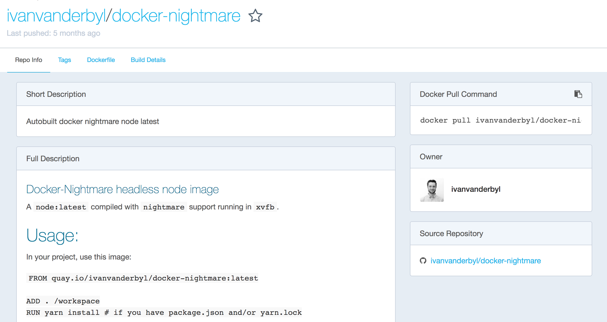

# Step 3

## Objective
Dockerize the web scraper i.e. run the code in a docker container, and obtain the resulting HTML file

## To execute the code in this directory, run the commands below
If you like to code it yourself, follow the steps in the [Development log](README.md#coding-changes-and-tools-installed-to-complete-the-objective-development-log)
* ```$ npm install -g yarn@0.18.1```
* ```$ yarn install```
* [Install Docker](https://www.docker.com/get-docker)
* ```$ docker pull ivanvanderbyl/docker-nightmare```
* ```$ docker build -t ecs_s3_scraper .```
* ```$ docker run -v /workspace/node_modules -v <absolute path>/ecs_s3_scraper/step3/:/workspace ecs_s3_scraper:latest index.js "code and coffee vancouver"```

*Note: We are using the yarn package manager from now onwards because our docker image uses it, and it is also better than npm*

## Coding changes and tools installed to complete the objective (Development log)

### Search for a nightmarejs docker image on [hub.docker.com](https://hub.docker.com)


### This one looks good.

1. The setup instructions make sense.
2. The github repo is linked.
3. The Dockerfile seems reasonable, although versions don't seem to be well defined.

*Note: Setting up nightmarejs is pretty straightforward (we did it with a few commands on our local machine), and creating a docker image is a pretty simple process (we will see this in the following steps), but why create your own if someone already has and other people are using it*


### Install docker
[Docker CE and EE for various platforms](https://www.docker.com/get-docker)

[I installed Docker CE for Mac](https://store.docker.com/search?type=edition&offering=community)


### Pull the nightmare docker image
```$ docker pull ivanvanderbyl/docker-nightmare ```


### Create Dockerfile and copy/paste the usage instructions into it
```
FROM ivanvanderbyl/docker-nightmare

ADD . /workspace
RUN yarn install
```
[*Above code has been referenced from here*](https://hub.docker.com/r/ivanvanderbyl/docker-nightmare/)

*Note: The Dockerfile uses yarn instead of npm to install the dependencies/libs. We can also use yarn instead of npm on our local machines. To know more about the differences between yarn and npm, [click here](https://www.sitepoint.com/yarn-vs-npm/)*


### Build the new docker image
```$ docker build -t ecs_s3_scraper . ```


### Run the scraper in a docker container
```$ docker run ecs_s3_scraper index.js "code and coffee vancouver" ```


### Wait, where is my HTML file ??!!
> It has been written to the filesystem of the docker container.
> More specifically, the /workspace directory of the container.
> The docker container turned off after running the command that it was supposed to.

We can prove this my doing to following
```
$ docker container ls -a
docker export <container_id> -o "scraper.tar.gz"
tar -xvf scraper.tar.gz -C scraper
ls scraper
```


### Mapping the local directory to docker container is the easiest way to output the HTML file on the local machine
[Explanation of how to do this from Docker docs](https://docs.docker.com/engine/tutorials/dockervolumes/#mount-a-host-directory-as-a-data-volume)

Basically,

```$ docker run -v /Users/<path>:/<container path> ... ```

Let's give this a try:

```$ docker run -v <absolute path>/ecs_s3_scraper/step3/:/workspace ecs_s3_scraper:latest index.js "code and coffee vancouver" ```

*Note: The directories have to be absolute path :(*

### Hmm, doesn't seem to work. The error looks like

```
Tue, 20 Jun 2017 21:07:55 GMT nightmare running
Tue, 20 Jun 2017 21:07:55 GMT nightmare electron child process exited with code 2: undefined
Tue, 20 Jun 2017 21:07:55 GMT nightmare electron child process not started yet, skipping kill.
```

> The error appears to indicate a problem with electron on the docker container. A bit of Googling suggests that since electron is a binary that was installed by nightmare, there might be a difference in the installation on our local machine (running OSX) and the docker container running Linux. 

Interesting...

**We are actually sharing the install between local and docker via the node_modules directory which has been mounted to /workspace/node_modules on the docker container, probably creating an issue with electron on the docker container**

Alright, so similar to .gitignore, Docker has .dockerignore.

Let us create .dockerignore and add node_modules and yarn.lock to it

```
node_modules/
yarn.lock
```

Trying once more...

```
$ docker build -t ecs_s3_scraper .
docker run -v <absolute path>/ecs_s3_scraper/step3/:/workspace ecs_s3_scraper:latest index.js "code and coffee vancouver"
```
*Note: docker build command may take a while longer than before because it is installing all the dependencies/libraries that used to previously be shared from the local machine*

Fails, with the same error!

**The problem is that even though we are installing the libraries on the docker image, when we run the image on the container, we share the node_modules from the local machine thereby leading to the same issue as before.**

> There is way to prevent the /workspace/node_modules directory from mounting onto the container as follows

```
$ docker run -v /workspace/node_modules -v <absolute path>/ecs_s3_scraper/step3/:/workspace ecs_s3_scraper:latest index.js "code and coffee vancouver"
```

### That seems to have worked! We have the same result as in Step 2

### Let's ensure the our local libraries are installed before moving onto Step 4
```$ yarn install ```
