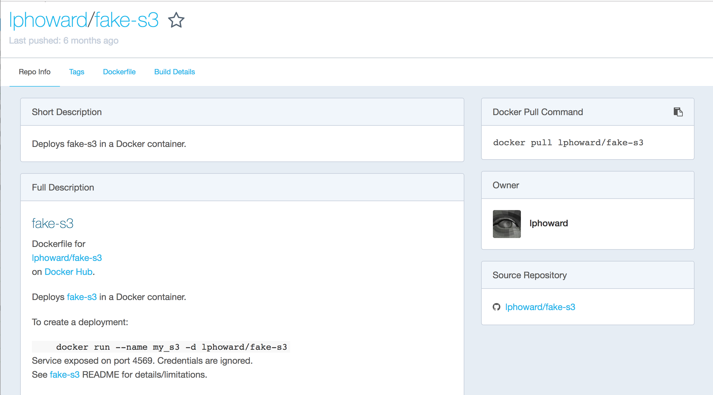

# Step 4

## Objective
Configure a mock AWS S3 running on a docker container, and write the HTML file from the dockerized web scraper to it

## To execute the code in this directory, run the commands below
If you like to code it yourself, follow the steps in the [Development log]
```
$ docker-compose build
docker-compose run scraper index.js "code and coffee vancouver"
```

## Coding changes and tools installed to complete the objective (Development log)

### Search for a fake S3 docker image on [hub.docker.com](https://hub.docker.com)


### This one looks really good.

1. The setup instructions make sense.
2. The github repo is linked.
3. The docker image is based on a [fake-S3 lib](https://github.com/jubos/fake-s3) that seems pretty solid
4. The fake-S3 has support for [node.js client](https://github.com/jubos/fake-s3/wiki/Supported-Clients#nodejs) using aws-sdk
5. The Dockerfile seems reasonable. It is uses versioning for almost all libraries except Ruby, so less chance of breaking in unexpected ways in the future.


### Pull the fake-s3 docker image
```$ docker pull lphoward/fake-s3 ```


### Run fake-s3 in a docker container

We want to run the container with port forwarding because it makes it easy to inspect the files using a web browser or a client, very similar to actual AWS S3

So, based on the usage instructions

```
$ docker run --name my_s3 -p 4569:4569 -d lphoward/fake-s3
```

If you visit [http://127.0.0.1:4569/](http://127.0.0.1:4569/) on your web browser, it should look like


*Note: Since we have named the docker container, we can stop and run it again by using the following simpler commands*
```
$ docker container stop my_s3
$ docker container ls
$ docker container start my_s3
```

### Alright, time to change index.js to write to fake-S3 instead of local machine

Following the instructions on [fake-s3 nodejs client](https://github.com/jubos/fake-s3/wiki/Supported-Clients#nodejs), let us go down the aws-sdk route. This way we can use the same code in AWS ECS on production.

So, let us install aws-sdk lib

```$ yarn add aws-sdk```

The guide gives us the following example
```
var AWS = require('aws-sdk')

var config = {
  s3ForcePathStyle: true,
  accessKeyId: 'ACCESS_KEY_ID',
  secretAccessKey: 'SECRET_ACCESS_KEY',
  endpoint: new AWS.Endpoint('http://localhost:10001')
}

var client = new AWS.S3(config)

var params = {
  Key: 'Key',
  Bucket: 'Bucket',
  Body: fs.createReadStream('./image.png')
}

client.upload(params, function uploadCallback (err, data) {
  console.log(err, data)
})
```

Let us modify this example for our case, and put the following code at the end of index.js file.
```
var AWS = require('aws-sdk')

var config = {
  s3ForcePathStyle: true,
  accessKeyId: 'ACCESS_KEY_ID',
  secretAccessKey: 'SECRET_ACCESS_KEY',
  endpoint: new AWS.Endpoint('http://localhost:4569')
}

var s3Client = new AWS.S3(config)

var params = {
  Key: options.keyword+'.html',
  Bucket: 'duckduckgo_htmls',
  Body: fs.createReadStream('./'+options.keyword+'.html')
}

s3Client.upload(params, function uploadCallback (err, data) {
  console.log(err, data)
})
```

*Note: I chose duckduckgo_htmls as our S3 bucket name*

Ok, let us give that a shot

```$ node index.js "code and coffee vancouver"```

WTH, it failed with the error below

```
{ Error: ENOENT: no such file or directory, open './code and coffee vancouver.html'
  errno: -2,
  code: 'ENOENT',
  syscall: 'open',
  path: './code and coffee vancouver.html' } undefined
```

Oh, bvheogfuefgjkb!!!!!, we are using promises, so we can't put the code at the end of index.js and expect it to work.

Alright, let us create a function as follows

```
function writeFileToS3(fileName) {
  var params = {
    Key: fileName,
    Bucket: 'duckduckgo_htmls',
    Body: fs.createReadStream(fileName)
  }

  s3Client.upload(params, function uploadCallback (err, data) {
    console.log(err, data);
  })
}
```

and call this function write after

``` fs.writeFileSync(options.keyword+'.html'); ```

Ok, let's give that another shot

```$ node index.js "code and coffee vancouver"```

No errors, great, looks like it worked, let's give [http://127.0.0.1:4569/](http://127.0.0.1:4569/) another visit.

It should look like


Yes! looks like we have duckduckgo_htmls Bucket. Let us give that a visit by going to [http://127.0.0.1:4569/duckduckgo_htmls](http://127.0.0.1:4569/duckduckgo_htmls)

It should look like


Download the HTML, and check if it looks alright.

Excellent! let us try running this in our nightmare docker container and see if have the same result

### Running code to write HTML to fake-S3 on a docker container

```
$ docker build -t ecs_s3_scraper .
docker run -v <absolute path>/ecs_s3_scraper/step4/:/workspace ecs_s3_scraper:latest index.js "code and coffee vancouver"
```

*Note: We need to rebuild our docker image because we have installed new dependencies/libraries such as aws-sdk that are not installed in our docker image*

Hmm, doesn't seem to work. The error looks like

```
Tue, 20 Jun 2017 21:07:55 GMT nightmare running
Tue, 20 Jun 2017 21:07:55 GMT nightmare electron child process exited with code 2: undefined
Tue, 20 Jun 2017 21:07:55 GMT nightmare electron child process not started yet, skipping kill.
```

The error appears to indicate a problem with electron on the docker container. A bit of Googling suggests that since electron is a binary that was installed by nightmare, there might be a difference in the installation on our local machine (running OSX) and the docker container running Linux. 

Interesting...

**We are actually sharing the install between local and docker via the node_modules directory which has been mounted to the docker container, probably creating an issue with the electron install on the docker container**

Alright, so similar to .gitignore, Docker has .dockerignore.

Let us create .dockerignore and add node_modules and yarn.lock to it

```
node_modules/
yarn.lock
```

Trying once more...

```
$ docker build -t ecs_s3_scraper .
docker run -v <absolute path>/ecs_s3_scraper/step4/:/workspace ecs_s3_scraper:latest index.js "code and coffee vancouver"
```
*Note: docker build command may take a while longer than before because it is installing all the dependencies/libraries that used to previously be shared from the local machine*

Fails, with the same error!

**The problem is that even though we are installing the libraries on the docker image, when we run the image on the container, we share the node_modules from the local machine thereby leading to the same issue as before.**

Alright, let us remove the mount point and try again

```$ docker run ecs_s3_scraper:latest index.js "code and coffee vancouver"```

AHA! That works, great success!!!

There are few issues that we have with this setup though.

1. Everytime we change the code in index.js, we have to rebuild the docker image since we can't mount the directory from the local machine.
2. There are quite a few steps to document/remember inorder to get this working on the local machine like the steps to building and running fake-S3 and the scraper, steps to testing locally vs docker etc.
3. We have hardcoded "https://localhost:4569" as an AWS S3 endpoint. The is going to be a problem when we try to deploy to AWS ECS.

Let us work on a solution to problems 1. and 2. next. We will tackle 3. in Step 5.

### Defining and running multi-container Docker applications using Docker compose

Docker Compose is a way to run docker containers like services in a multi-container application environment.

[Here is a good intro and guide from Docker](https://docs.docker.com/compose/overview/). It is worth going over because it has some practical examples that you can follow along.

Looking an example docker-compose.yml file from the link above

```
version: '3'
services:
  web:
    build: .
    ports:
      - "5000:5000"
    volumes:
      - .:/code
      - logvolume01:/var/log
    links:
      - redis
  redis:
    image: redis
volumes:
  logvolume01: {}
```

At a high level, what we have above are 2 services - web and redis. The web service is configured to build a docker image from the working directory, while the redis service uses an existing docker image. The web service has other configuration such as ports and volumes. Finally, the web service is setup to link to the redis service. 

We can setup our services in a similar way.

This appears to solve our problem of having to document/remember most of the setup and run commands.

Inorder to solve the other problem of having to rebuild the docker image everything, we change the "volumes" configuration to something like:

```
volumes:
  - .:/workspace
  - /workspace/node_modules
```

**This tells Docker Compose to mount the working directory to /workspace, but leave /workspace/node_modules alone.**

Checkout [Docker Compose Volumes](https://docs.docker.com/compose/compose-file/#volumes) for more information on this. Also, there are some nuances around networking and port forwarding in Docker Compose, for which [Networking in Compose](https://docs.docker.com/compose/networking/) is worth a read.

Ok, so let us create our docker-compose.yml file

```
version: '3'
services:
  scraper:
    build: .
    volumes:
      - .:/workspace
      - /workspace/node_modules
    links:
      - s3
    depends_on:
      - s3
  s3:
    image: lphoward/fake-s3
    ports:
      - "4569:4569"
```

Lastly, we need to change "http://localhost:4569" to http://s3:4569" in index.js for the networking amongst the services to work properly.

Ok, now we can build our images, and after that run the docker containers as services - all of this is going to use the defintions in docker-compose.yml

```
$ docker-compose build
docker-compose run scraper index.js "code and coffee vancouver"
```

WOAH! Everything seems to have run fine. Lets check our fake-s3 to ensure that the HTML file is there, and we are done!

**Time to celebrate!!! :)**
